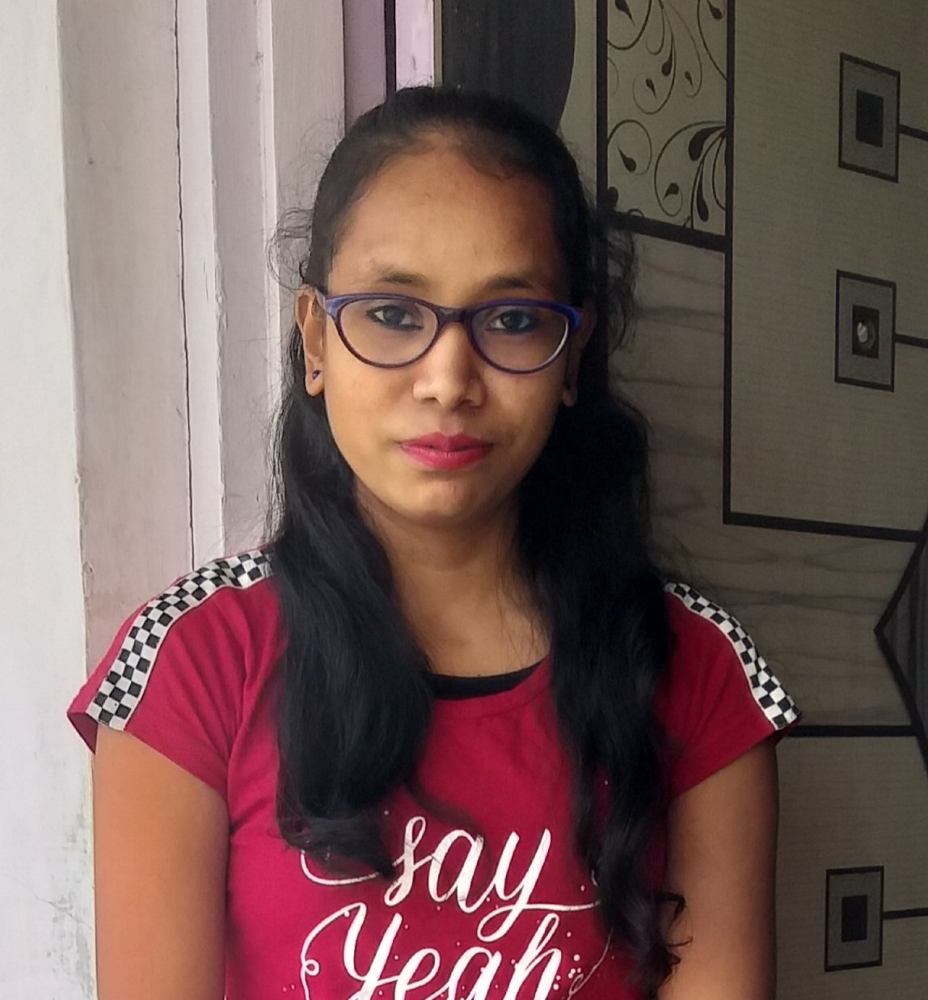

<!DOCTYPE html>
<html lang="en" >
<head>
  <meta charset="UTF-8">
  <title>Profile Card</title>
  <meta name="viewport"
      content="width=device-width, user-scalable=no, initial-scale=1.0, maximum-scale=1.0, minimum-scale=1.0"><link rel="stylesheet" href="assets/normalize.min.css">
<link rel="stylesheet" href="assets/style.css">
</head>
<body>

  

    

      
    

    

      
Anjana Vasava

      
PHP Developer

      

        
          Ankleswar,Bharuch
          
  

        
        
      

      

        <a href="https://github.com/anjana1511" class="github-tab">Github</a>
        <a href="https://www.linkedin.com/in/anjana-vasava-442079140" class="linkedin-tab">LinkedIn</a>
        <a href="javascript:void(0);" class="intagram-tab">Instagram</a>
      

      <ul class="skill-cloud">
        <li>PHP Developer</li>
        <li>Back End Developer</li>
        <li>Front End Developer</li>
        <li>HTML</li>
        <li>CSS</li>
        <li>JavaScript</li>
        <li>Mysql</li>
        <li>Laravel</li>
      </ul>
      

      

      

      

      

    

  

    
  

</body>
</html>
